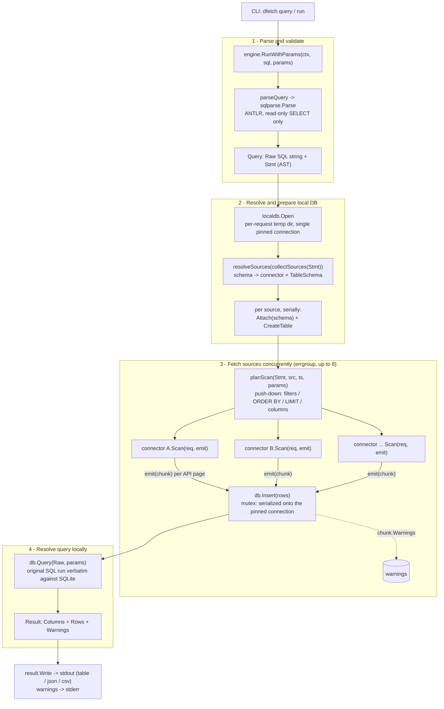

# dfetch

[](https://github.com/dmashuda/dfetch/actions/workflows/ci.yaml)
[](https://pkg.go.dev/github.com/dmashuda/dfetch)
[](https://goreportcard.com/report/github.com/dmashuda/dfetch)
[](https://github.com/dmashuda/dfetch/releases/latest)
[](LICENSE)

Query and join data across any data source with SQL, on demand.

`dfetch` takes a SQL query (SQLite syntax), validates it, fetches each referenced
data source (exposed as a SQLite table), loads it into a **per-request local
SQLite database**, and runs your query against that database. You get the full
power of SQLite — joins across sources, aggregates, JSON functions — over live
data from APIs.

```sh
dfetch query "SELECT number, title, state FROM github.issues
              WHERE owner='golang' AND repo='go' AND state='open'
              ORDER BY updated_at DESC LIMIT 10"
```

## Install

Download a prebuilt binary from the
[latest release](https://github.com/dmashuda/dfetch/releases/latest)
(`linux/amd64`, `darwin/arm64`, `windows/amd64`), then put it on your `PATH`:

```sh
tar xzf dfetch_linux_amd64.tar.gz && sudo mv dfetch /usr/local/bin/
dfetch version
```

For Nix users, see [nix.md](./nix.md)

To build from source instead, see [CONTRIBUTING.md](CONTRIBUTING.md).

## Quick start

```sh
# what can I query?
dfetch tables

# run a query — default output is an aligned table; --format json|csv also work
dfetch query "SELECT number, title FROM github.issues
              WHERE owner='octocat' AND repo='Hello-World'" --format json
```

A data source is a **connector** that exposes one or more tables under a SQL
schema (e.g. `github.issues`). dfetch pushes filters, `ORDER BY`, and `LIMIT`
down to each source where it safely can, then resolves the _full_ query locally
in SQLite — so the result is always correct even when a connector returns a
superset of the rows.

## Commands

| command                       | description                                                                                                |
| ----------------------------- | ---------------------------------------------------------------------------------------------------------- |
| `dfetch query "<sql>"`        | Run a SQL query. `--format table\|json\|csv` (default `table`). `dfetch query -` reads the SQL from stdin. |
| `dfetch run <name> [args...]` | Run a saved query, binding args to its params. `--all-columns`, `--format`.                                |
| `dfetch queries`              | List saved queries with their parameters and descriptions.                                                 |
| `dfetch tables [schema]`      | List available tables and columns, optionally for one schema.                                              |
| `dfetch version`              | Print the version (also `dfetch --version`).                                                               |

`--config <path>` (global) points at a config file; the default is `./dfetch.yaml`
in the current directory, then `$XDG_CONFIG_HOME/dfetch/dfetch.yaml`, falling back
to `~/dfetch.yaml` (see [Configuration](#configuration)).

## Connectors

dfetch ships with nine connectors — six built in (no configuration) plus
configured PostgreSQL, New Relic, and Jira `type`s:

| schema     | source                              | tables                                                                        |
| ---------- | ----------------------------------- | ----------------------------------------------------------------------------- |
| `github`   | GitHub REST API                     | issues, pulls, repos, commits, releases, workflow_runs, artifacts             |
| `jaeger`   | Jaeger api_v3                       | spans, services, operations                                                   |
| `datagov`  | data.gov / CKAN                     | datasets, resources, organizations, groups                                    |
| `docker`   | Docker Engine API                   | containers, images, volumes, networks                                         |
| `slack`    | Slack Web API                       | channels, users, messages, search                                             |
| `files`    | local data files                    | any CSV/TSV/JSON/JSONL file under the working directory (dynamic)             |
| `postgres` | PostgreSQL (config `type`)          | any table (dynamic discovery)                                                 |
| `newrelic` | New Relic NerdGraph (config `type`) | any NRDB event type (dynamic) + accounts, entities, alerts, issues, incidents |
| `jira`     | Jira Cloud REST API (config `type`) | issues, projects, comments                                                    |

See **[connectors.md](connectors.md)** for each connector's connection details,
required filters, columns, push-down behavior, and runnable query examples.

## Saved queries

Store reusable, parameterized queries in your `dfetch.yaml` (see
[Configuration](#configuration)) under a `queries` list. Each query has a `name`
(used by `dfetch run`), an optional `description`, an ordered list of `params`
bound as `:name` placeholders in the `sql`, and an optional `columns` list that
selects the default output columns:

```yaml
queries:
  - name: repo-issues
    description: Open issues for a repo
    params: [owner, repo] # bound positionally
    columns: [number, title, user_login]
    sql: SELECT * FROM github.issues WHERE owner = :owner AND repo = :repo AND state = 'open'
```

```sh
dfetch queries                             # list saved queries
dfetch run repo-issues golang go           # binds :owner=golang, :repo=go
dfetch run repo-issues golang go --all-columns   # every column the query produces
```

Positional arguments bind to `params` in order. Parameters are SQLite bind values,
so they substitute values (not table or column names). When `columns` is set,
output is narrowed to those columns unless `--all-columns` is passed.

## Configuration

dfetch works with no config. To point a connector at a non-default host, or to
register a connector under additional schemas, create a `dfetch.yaml` in the
directory you run dfetch from — config is per-project. dfetch looks for
`./dfetch.yaml` first, then `$XDG_CONFIG_HOME/dfetch/dfetch.yaml` (defaulting to
`~/.config/dfetch/dfetch.yaml`), and falls back to `~/dfetch.yaml`; `--config <path>`
overrides both. Each `sources` entry binds a SQL schema `name` to a connector
`type`, with connector-specific `params`:

```yaml
sources:
  - name: gh-enterprise # queried as gh-enterprise.issues
    type: github
    params:
      base_url: https://github.example.com/api/v3
  - name: prod-traces # queried as prod-traces.spans
    type: jaeger
    params:
      base_url: http://jaeger.example.com:16686
```

## Tracing

dfetch is instrumented with OpenTelemetry. Tracing is **off unless an OTLP
endpoint is configured** — without it there's no exporter and effectively no
overhead. To capture traces for debugging, run the bundled OpenTelemetry
Collector + Jaeger stack and point dfetch at the collector (which batches and
forwards to Jaeger — swap or add exporters in `otel-collector.yaml` without
touching dfetch):

```sh
docker compose up -d                # otel-collector (:4318) -> Jaeger (UI :16686)
export OTEL_EXPORTER_OTLP_ENDPOINT=http://localhost:4318
dfetch query "SELECT number, title FROM github.issues
              WHERE owner='golang' AND repo='go' AND state='open'
              ORDER BY updated_at DESC LIMIT 5"
# open http://localhost:16686 and pick service "dfetch"
```

To additionally ship traces to an external backend (e.g. New Relic), copy
`docker-compose.override.example.yml` to `docker-compose.override.yml`
(gitignored) — it layers `otel-collector.newrelic.yaml` onto the collector,
keyed by `$NEW_RELIC_LICENSE_KEY`. The default stack stays local-only.

Each CLI invocation is one trace, rooted in a `cli.<command>` span (so
`dfetch tables`, `dfetch run`, … are traced too, not just `query`):

```
cli.query (cli.args=[query SELECT …])
└─ engine.Run (db.query.text=<sql>)
   ├─ engine.parse               → what the parser understood (tables, joins, limit, …)
   ├─ engine.loadSource (github.issues)
   │  ├─ connector.scan          → one HTTP GET span per API page (otelhttp)
   │  └─ ATTACH / CREATE / INSERT (otelsql)
   └─ SELECT                      (the local resolve; otelsql)
```

Use it to see how many API calls a query made (pagination shows as multiple `GET`
spans), where latency went (API vs. local SQL), and which step failed (failed
spans are marked with the error). Set `OTEL_SERVICE_NAME` or other standard
`OTEL_*` vars to customize; `OTEL_SDK_DISABLED=true` forces tracing off.

Because the Jaeger connector queries Jaeger, you can analyze these traces with
dfetch itself — see the [Jaeger connector](connectors.md#jaeger--schema-jaeger).

## How a query runs

A query flows through four stages: parse the SQL, resolve and prepare a
per-request local SQLite database, fetch every referenced source concurrently and
load it as it arrives, then run the original SQL **verbatim** against SQLite (the
source of truth — connectors may return a superset, which SQLite trims).



Stages 1, 2, and 4 are serial; stage 3 fans out. Each source is planned into a
push-down `ScanRequest`, scanned by its connector (which streams one chunk per API
page through `emit`), and loaded into the local DB as each chunk arrives —
serialized by a mutex onto the single pinned connection. The first error cancels
the whole group. See the orchestration in `engine/engine.go`.

## Use as a library

dfetch is importable as a Go module: the CLI is a thin wrapper over the same
public packages. `engine.New` takes functional options, carries **no default
connectors**, and every piece is swappable:

```go
import (
    "github.com/dmashuda/dfetch/engine"
    "github.com/dmashuda/dfetch/source"
)

// Your own data source: implement source.Connector (Tables + Scan) and
// register it under a schema name.
eng, err := engine.New(engine.WithConnector("mydata", myConn))
res, err := eng.Run(ctx, `SELECT * FROM mydata.items WHERE state = 'open'`)
```

**The stock connector set** lives in the `connectors` package (importing
`engine` alone doesn't link pgx or any API client). This reproduces the CLI's
setup:

```go
import "github.com/dmashuda/dfetch/connectors"

opts, err := connectors.DefaultOptions() // builtins + default registry
eng, err := engine.New(append(opts, engine.WithConnector("mydata", myConn))...)
```

**Config without YAML files** — `config.Config` is plain data, so build it in
code (or load it with `config.Load`) and pass it with `engine.WithConfig`;
typed sources are built through the registry from `engine.WithRegistry`:

```go
eng, err := engine.New(
    engine.WithRegistry(connectors.DefaultRegistry()),
    engine.WithSources(config.SourceConfig{
        Name:   "warehouse",
        Type:   "postgres",
        Params: map[string]any{"dsn": dsn, "schemas": []string{"public"}},
    }),
)
```

Options apply in order and the last registration of a schema name wins, which
is how config overrides a builtin. `WithRegistry` merges rather than replaces,
so appending your own registry after `connectors.DefaultOptions()` adds or
overrides connector types without losing the default ones.

**Credentials without env vars** — every connector secret resolves through the
same chain: a plain param, else its env var(s), else a `<x>_func` param holding
a Go function, else a `<x>_command` param naming a command to run. The function
form only exists for programmatic config (YAML can't express it) and is how an
embedding program plugs in its own secret store:

```go
eng, err := engine.New(
    engine.WithRegistry(connectors.DefaultRegistry()),
    engine.WithSources(config.SourceConfig{
        Name: "github",
        Type: "github",
        Params: map[string]any{
            "token_func": func(ctx context.Context) (string, error) {
                return mySecrets.Fetch(ctx, "github-token")
            },
        },
    }),
)
```

Resolution is lazy (first use of the schema), cached on success for the
connector's lifetime (failures retry on the next query), and race-safe. Custom connectors get the same behavior from
`source.NewCredential`.

**Custom SQLite management** — the engine drives the per-request database
through the `engine.DB` interface (`Attach`, `CreateTable`, `Insert`, `Query`,
`Close`) and opens one per run via `engine.WithDB`. The default is `localdb`
(temp files, removed on close); supply your own opener to control file
placement, caching, or lifecycle:

```go
eng, err := engine.New(
    engine.WithConnector("mydata", myConn),
    engine.WithDB(func(ctx context.Context) (engine.DB, error) {
        return myDBManager.Open(ctx) // must implement engine.DB
    }),
)
```

Tracing works the same as the CLI: spans go to the global OpenTelemetry tracer
provider, a no-op unless your program installs one.

## Contributing

Building from source, running the tests, and **writing a new connector** are
covered in [CONTRIBUTING.md](CONTRIBUTING.md). To report a vulnerability, see
[SECURITY.md](SECURITY.md).

## License

dfetch is released under the [MIT License](LICENSE). The bundled ANTLR SQLite
grammar (`internal/sqlparse/grammar/`) is licensed under BSD-3-Clause by its
original authors; those headers are preserved.
